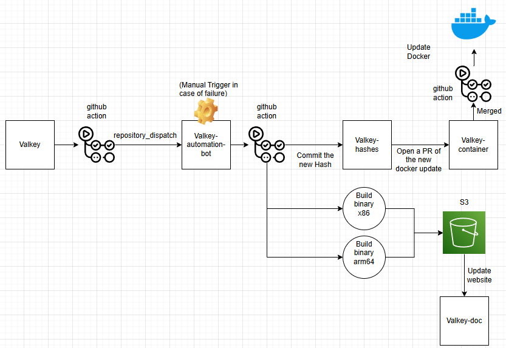

# Automation for Valkey release
This is a Proof of Concept design to automate the process of release a new version for valkey. We can use a centralize repository to automate the process of `build the binary files` -> `commit the new hash` -> `update the docker description`

## Current release process
Currently we still don't have a unified process to automate the workflow. These are the steps still happen manually:

1. Updating the valkey-hashes repository.
2. Running a update script on valkey-container and committing the changes which triggers containers workflow to upload the images.
3. Updating the website downloads page with the new releases.

*Originally posted by @roshkhatri in [#1396 (comment)](https://github.com/valkey-io/valkey/issues/1396#issuecomment-2521718877)*

Below is the diagram of the current process:

## Propose Design
To automated this process, we would create a centralized repository to take care of all these processes.
1. Create a `valkey-automation-bot` repo that will be triggered when the main `valkey` repo release a new version.
   
2. In this `valkey-automation-bot` repo, the workflow will run the following steps: `build the binary files` -> `Open a PR for valkey-hashes` -> `Open a PR for valkey-container`.
   
3. We can remove the `build-release-packages.yml`, `call-build-linux-arm-packages.yml`, `call-build-linux-x86-packages.yml` from `valkey` repo.

> We need the PAT token that can give access to create a PR for `valkey-container` repo and `valkey-hashes` repo.

Below is the flow diagram of the design:

**Github action jobs**

## Proof of concept reference
[Valkey repo trigger](https://github.com/Autxmaton/valkey/blob/unstable/.github/workflows/trigger-build-release.yml)

[Valkey-automated-bot](https://github.com/Autxmaton/valkey-automated-bot)

[Valkey-container](https://github.com/Autxmaton/valkey-container)

[Valkey-hashes](https://github.com/Autxmaton/valkey-hashes)

## Result

**PR for valkey-hashes**

**PR for Docker Update**
